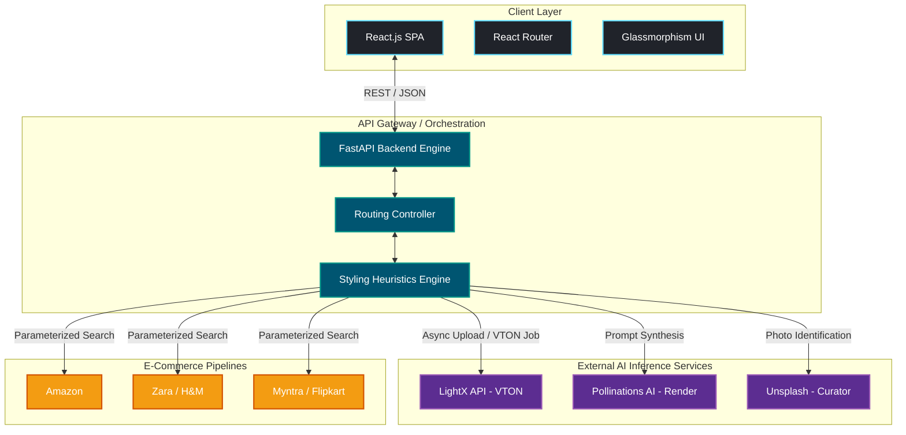

<div align="center">

# 💎 Vestiary
### Enterprise-Grade AI Fashion Stylist & Virtual Try-On Platform

[](https://reactjs.org/)
[](https://vitejs.dev/)
[](https://fastapi.tiangolo.com/)
[](https://www.python.org/)
[]()
[]()

*Bridging the gap between digital imagination and physical reality in personal styling.*

[Report Bug](https://github.com/SAK-SHI14/Vestiary/issues) · [Request Feature](https://github.com/SAK-SHI14/Vestiary/issues) 

</div>

---

## 📖 Table of Contents
- [Executive Summary](#-executive-summary)
- [System Architecture](#-system-architecture)
- [Enterprise Features](#-enterprise-features)
- [Technology Stack](#-technology-stack)
- [Quick Start Guide](#-quick-start-guide)
  - [Prerequisites](#prerequisites)
  - [Local Development Setup](#local-development-setup)
- [API Documentation](#-api-documentation)
- [Deployment Strategy](#-deployment-strategy)
- [Project Roadmap](#-project-roadmap)
- [Contributing](#-contributing)
- [License & Contact](#-license--contact)

---

## 🌟 Executive Summary

**Vestiary** is a state-of-the-art fashion technology platform that replaces static catalog browsing with an intelligent, hyper-personalized AI styling assistant. By synthesizing multi-dimensional user heuristics—such as body morphology, occasion context, real-time weather, and color theory—Vestiary intelligently orchestrates complete modular outfits. 

Going beyond simple text recommendations, Vestiary integrates advanced **Generative AI for cinematic visualization** and a highly robust **Virtual Try-On (VTON) spatial computing pipeline**. It seamlessly bridges the gap to commercial conversion by providing cross-platform "Shop the Look" capabilities across leading global e-commerce infrastructure (Amazon, Zara, H&M, etc.).

---

## 🏗 System Architecture

Vestiary implements a decoupled, highly-concurrent microservices-oriented architecture designed for scale, fault tolerance, and independent service iteration.



---

## 🚀 Enterprise Features

* **🧠 Deep Styling Heuristics Pipeline:** Synthesizes billions of potential outfit combinations using dynamic prompt engineering and 6 distinct parameter axes (`gender`, `body_type`, `color`, `climate`, `occasion`, `aesthetic`).
* **📸 Asynchronous Virtual Try-On (VTON):** Provides high-fidelity virtual try-on mechanics using the external LightX compute framework. Handles robust state management, preemptive presigned URL uploads, async compute pooling, and timeout mitigation.
* **🎥 Generative Semantic Rendering:** Translates abstract outfit configurations into high-end cinematic/Ghibli aesthetic product photography, strictly controlling for prompt collision and image repetition.
* **👙 Context-Aware Undergarment Module:** A highly specialized algorithmic branch assessing the geometry of recommended out-wear (e.g., plunge cuts, backless dresses) to map to optimal foundation garments.
* **🛒 Omni-channel Commerce Routing:** Maps simulated product objects to verified parametric deep-links across Amazon, Myntra, Flipkart, Ajio, Zara, and H&M.

---

## 🛠 Technology Stack

### Client Operations (Frontend)
* **Core Framework:** React 19 optimized with Vite for Sub-millisecond HMR
* **State Management:** React Hooks & Component Context
* **Routing Strategy:** React Router v7
* **Design System:** Pure Vanilla CSS utilizing advanced CSS variables, grid layers, and Glassmorphism optics.

### Server Operations (Backend)
* **Engine:** Python 3.10+ running FastAPI (ASGI) via Uvicorn
* **Data Validation:** Pydantic models mapping enforced schema types 
* **I/O Management:** HTTPX for asynchronous, non-blocking outbound requests to remote AI services
* **Security Middleware:** Enforced CORS policies and parameterized URL encoding protections.

---

## ⚡ Quick Start Guide

### Prerequisites
Before orchestrating this platform locally, ensure your environment is provisioned with:
* **Node.js**: `v18.0.0` or higher
* **Python**: `3.9.0` or higher (3.10+ recommended)
* **Git**: CLI interface

### Local Development Setup

**1. Clone the Source**
```bash
git clone https://github.com/SAK-SHI14/Vestiary.git
cd Vestiary
```

**2. Provision the Backend API Service**
```bash
cd backend
python -m venv venv
# Activate VENV: `source venv/bin/activate` (Mac/Linux) or `venv\Scripts\activate` (Windows)
pip install -r requirements.txt
uvicorn main:app --reload --host 0.0.0.0 --port 8000
```
> The API Gateway will initialize on `http://localhost:8000`. Swagger API documentation is instantly available at `/docs`.

**3. Provision the Frontend Client**
*Open a concurrent terminal session:*
```bash
cd frontend
npm install
npm run dev
```
> The React client will compile and broadcast on `http://localhost:5173`.

---

## 💻 API Documentation

The backend adheres to severe REST operational standards. 

### `POST /generate_outfit`
**Purpose:** Executes styling telemetry and returns a bundled outfit response payload.
**Required Headers:** `Content-Type: application/json`

<details>
<summary>View Request Payload Specifications</summary>

```json
{
  "gender": "female",
  "body_type": "hourglass",
  "preferred_color": "burgundy",
  "weather": "chilly",
  "occasion": "party",
  "style_preference": "elegant"
}
```
</details>

### `POST /try_on`
**Purpose:** Dispatches an asynchronous VTON composite job queue combining human uploads with specific garment target URLs. Enforces base64 image decoding.

<details>
<summary>View Request Payload Specifications</summary>

```json
{
  "person_image_base64": "data:image/jpeg;base64,/9j/4AAQSkZJ...",
  "garment_url": "https://example.com/target-garment-image.jpg",
  "garment_description": "Burgundy Sequin Midi Dress"
}
```
</details>

---

## 🌍 Deployment Strategy

Vestiary is structured natively for scaling across distributed cloud environments.

* **Client Aggregation (Frontend):** 
  Targeted for edge-compute delivery platforms. Connect your Github branch to **Vercel** or **AWS Amplify**. 
  - *Build Command:* `npm run build`
  - *Output Directory:* `dist`
* **API Delivery (Backend):** 
  Targeted for ephemeral container instances. Deploy the backend directory tree via **Render**, **Railway**, or **AWS App Runner**. 
  - *Startup Execution:* `uvicorn main:app --host 0.0.0.0 --port $PORT`

---

## 🛣 Project Roadmap

- [x] Version 4.0: LightX Virtual Try-On Integrations
- [x] Version 4.1: Asynchronous Request Homing & Timeout Stabilization
- [ ] Version 5.0: AWS RDS / PostgreSQL database layer for user profile persistence
- [ ] Version 5.1: Real-time vendor inventory tracking API (Amazon PAAPI)
- [ ] Version 6.0: Wardrobe digitizing via computer vision (upload your closet)

---

## 🤝 Contributing

We enforce high standards for contribution to maintain platform integrity, but welcome all enhancements from the engineering community.

1. Fork the Project Repository
2. Initialize a secure Feature Branch (`git checkout -b feature/EnhancedHeuristics`)
3. Commit your logic (`git commit -m 'feat: Add EnhancedHeuristics module'`)
4. Push to remote (`git push origin feature/EnhancedHeuristics`)
5. Open a well-documented Pull Request

---

## 📜 License & Contact

**Architected & Maintained by Sakshi Verma**

[](https://github.com/SAK-SHI14)
[](https://www.linkedin.com/in/sakshi-verma-) *(Update link as needed)*

<div align="center">
  <p><i>Building the infrastructure for the next generation of digital fashion.</i></p>
</div>
